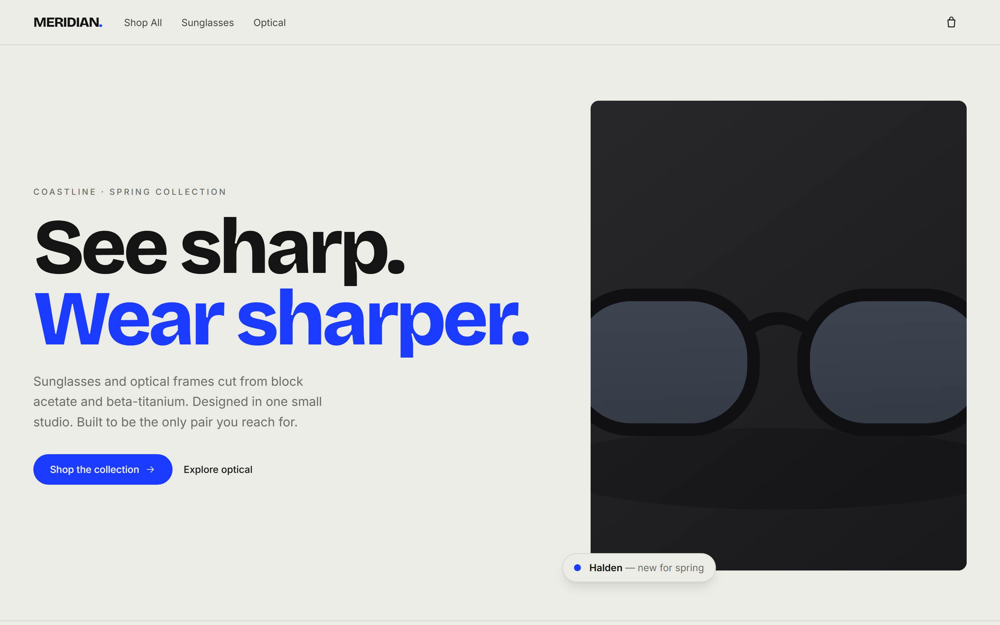

# Meridian — Modern Eyewear Storefront

> A fashion-forward, editorial storefront for a fictional eyewear brand. Built as a **frontend portfolio piece** to demonstrate clean, typed, production-shaped Next.js with a distinctive visual identity and polished motion — not a template.



Meridian sells sunglasses and optical frames cut from Italian block acetate and beta-titanium. The site is fully interactive with a client-side cart (React Context), client-side product filtering, and a slide-over cart drawer — no backend required.

---

## Stack

- **Next.js 14** (App Router, Server + Client Components)
- **TypeScript** (strict)
- **Tailwind CSS** (design tokens in `tailwind.config.ts`)
- **Framer Motion** — page transitions, tap/hover micro-interactions and scroll reveals
- **next/font/google** — Bricolage Grotesque (display) + Inter (body)
- Product art is rendered as inline SVG, so the app builds and runs fully offline.

## Features

- **Editorial home** — oversized brand headline overlapping the hero product image with a confident cobalt accent, featured collection grid, a dark "craft / materials" contrast block, and a newsletter footer.
- **Shop page** (`/products`) — client-side filter rail (category, max-price slider, color) plus sort, with a mobile filter sheet. Reflows from 1 → 3 columns and animates the grid on filter changes.
- **Product detail** (`/products/[slug]`) — gallery with a crossfading view selector, lens selector that updates the price, add-to-bag, a specs table, and an accessible details accordion, followed by related products.
- **Cart** — React Context drives a site-wide slide-over drawer with quantity controls, a live subtotal, and a header badge with the item count. Adding merges identical product + lens lines.
- **Quick-add** — product cards reveal a cobalt quick-add button on hover/focus that drops the default configuration straight into the bag and opens the drawer.
- **Motion** — smooth page transitions between routes, tap feedback on every button, hover lift and staggered scroll-reveal on product cards, and an animated cart drawer that slides in **and** out. All driven by Framer Motion and globally gated by `reducedMotion="user"`.
- **Accessible & responsive** — semantic landmarks, skip link, `focus-visible` rings, `aria` on icon buttons, the drawer traps focus and closes on `Esc`, all art/images carry alt semantics, and everything honors `prefers-reduced-motion`.

## Getting started

```bash
npm install
npm run dev
```

Then open <http://localhost:3000>.

> **Tip:** don't run `npm run build` while `npm run dev` is running — the dev server and the production build share the `.next` cache and will clash. Stop the dev server first.

Other scripts:

```bash
npm run build   # production build
npm run start   # serve the production build
npm run lint    # next lint
```

## Design notes

The brief was to avoid two clichéd "AI storefront" looks (cream + serif + terracotta, and near-black + acid-green). Meridian instead runs a cool, confident editorial system:

- **Palette** — `paper #ECECE6` (cool off-white, not warm cream), `ink #141414`, `muted #6C6C66`, `hairline #D6D6CE`, and one decisive accent, `cobalt #1B3BFF`, used on buttons, links and hero details. Dark contrast sections use `night #17171A`.
- **Type** — display is **Bricolage Grotesque** (600/700/800) for big, expressive, tightly-tracked headings; body is **Inter**. No serif display. The hero headline runs on a large `clamp()` scale.
- **Layout** — generous whitespace, an editorial grid, 1px hairline dividers, minimal border-radius on structural elements with pill buttons, and a strong left-aligned typographic hero.
- **Signature moment** — the hero statement headline overlapping the product image with a floating cobalt "new for spring" tag, plus the smooth quick-add interaction on cards. The rest of the UI stays deliberately disciplined.

Tokens live in `tailwind.config.ts` (`theme.extend.colors` / `fontFamily`); shared component classes (`btn-primary`, `eyebrow`, `container-editorial`, `link-underline`) live in `app/globals.css`; shared motion values live in `lib/motion.ts`.

## Product imagery

To guarantee an offline, dependency-free build, product visuals are generated as deterministic inline SVG (`components/ProductArt.tsx`) from each frame's colorway. If you'd rather use photography, `next.config.mjs` already configures `images.remotePatterns` for `images.unsplash.com` — swap `ProductArt` for `next/image` with Unsplash URLs and it will build.

## Project structure

```
app/
  layout.tsx              # fonts, providers, header/footer/drawer shell
  template.tsx            # per-navigation page transition
  page.tsx                # home
  globals.css             # tokens + component utilities
  not-found.tsx
  products/
    page.tsx              # shop (reads ?category / ?sort)
    [slug]/page.tsx       # product detail (static params + metadata)
components/
  Providers.tsx           # MotionConfig + Cart Context  ('use client')
  CartProvider.tsx        # cart Context + reducer
  CartDrawer.tsx          # animated, focus-trapped slide-over
  Header.tsx  Footer.tsx  Newsletter.tsx
  ShopClient.tsx          # filtering/sorting UI
  ProductCard.tsx         # card + quick-add + reveal
  ProductDetail.tsx       # detail buy column
  Reveal.tsx              # scroll-reveal wrapper
  Accordion.tsx  ProductArt.tsx  icons.tsx
lib/
  products.ts             # 8 frames of crafted mock data
  motion.ts               # shared easing / variants / tap
  types.ts  utils.ts
```

---

*Portfolio project. Meridian is a fictional brand; all copy, models and prices are invented for demonstration.*
